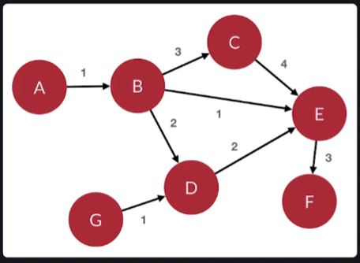

# Unit 5.4 M1 Objective 2

Note remember to refer to the markdown preview of this file to see the picture. 


1. Using the graph show in this picture, write python code to represen the graph in an adjacency list. 
```python
class Graph: 
    def _inti_(self):
        self.verticies = {
            "A": {"B": 1},
            "B": {"C": 3, "D": 2, "E": 1},
            "C": {"E": 4},
            "D": {"E": 2},
            "E": {"F": 3},
            "F": {},
            "G": {"D": 1},
        }

```

2. Using the same graph, write python code to represent the graph in an adjacency matrix. 
```python
class Graph:
    def _init_(self):
        self.edges = [
        [0, 0, 0, 0, 0]    
        [0, 0, 0, 0, 0]    
        [0, 0, 0, 0, 0]    `
        [0, 0, 0, 0, 0]    `
        [0, 0, 0, 0, 0]    `
        [0, 0, 0, 0, 0]    `

        ]


```


